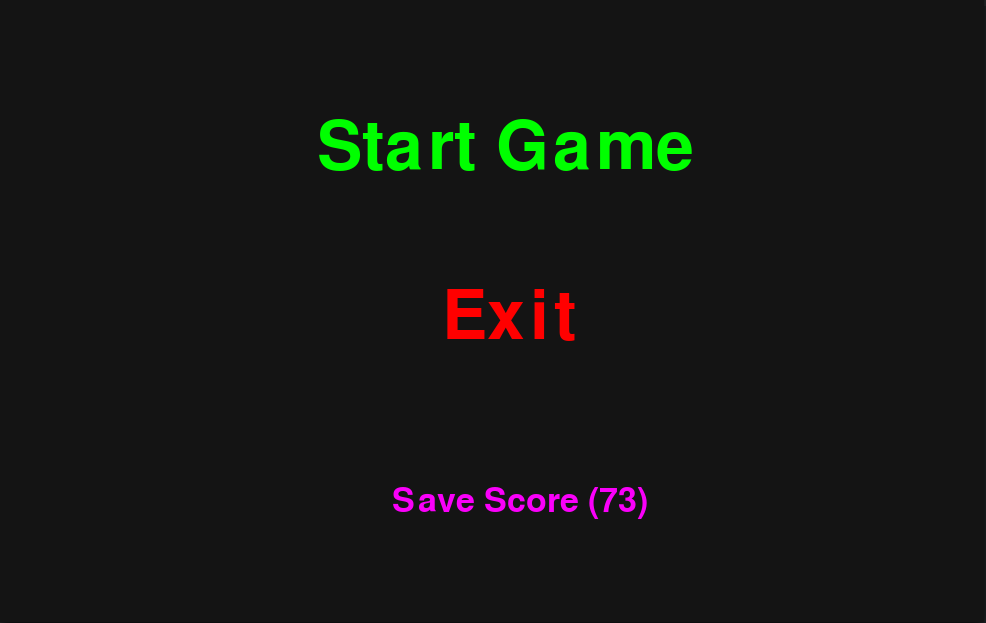
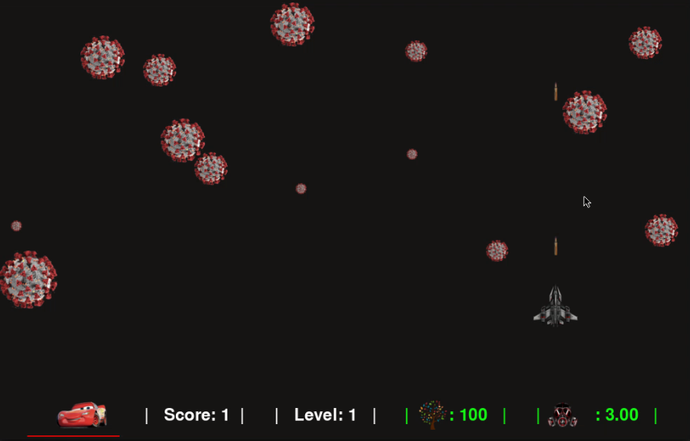

# StopCovid19Game is a Fun game in context of current Covid19 World Pandemic.
I am not a game developer but working on it and seeing the result, given that of course this is not the worlds most complex game, makes me a bit happier.
Hope you will enjoy. We Will Defeat It Together!

### This is the start screen, where you can save your score (which will become visible at https://uct.ge/covid19_game)

### And this is the screenshot of one level

### Executable files ar available for Linux(https://uct.ge/covid19_game/download_game_file/linux/) and Windows(https://uct.ge/covid19_game/download_game_file/windows/)
### But the most reliable way to play without possible errors, would be to install Python(3.7+) with Pygame and Requests modules(to save your score).

### Keys to know before starting:
1) Move around - ARROW KEYS(←↑→↓)
2) Shoot - SPACE
3) Activate shield - A
4) Remove shield - R
5) Exit from start screen - E
6) Start game from start screen - S
### That's it.

### If you want to add more rounds/features or refine things, you are welcome, code is freely available here.

* I used images from free animation image websites, but if you have any concern about this topic, fell free to contact me at tornike.skhulukhia.1@iliauni.edu.ge
